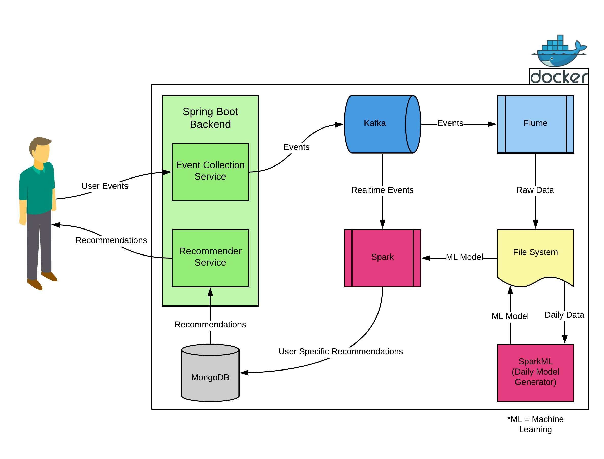

# End to End Recommender System Development

## Description

The aim of this project is teaching how to develop a recommender system and create necessary data pipeline to feed a recommendation system. To achieve that purpose, attendants must research and learn the basics of required technologies such as Docker, Spark Streaming & Spark ML, Kafka, Flume, Spring Boot and MongoDB. Architecture of the project is visualized in figure below.

	Figure 1: Visualized architecture of the project.

## 14 Days Learning Plan

* Git & Docker investigating (2 days)

* Design and develop a basic Spring Boot Rest API which will provide 2 functionalities:

	* An event collection service

		* Forward user generated data to Kafka with a proper format (1 day)

	* User recommendation service

		* Return user’s preprocessed recommendations from MongoDB. (1 day)

* A flume service which will read data from Kafka and write to a FileSystem (1 day)

* A scheduled SparkML service will read collected data daily/hourly and will export a trained model from data. (3 days)

* A Spark job will read user actions in real-time, and produce user recommendations from pretrained model and then save to MongoDB. (3 days)

* Dockerize all applications & provide a docker-compose file for easy initialization of the system (3 days)

### Other Requirements

* All tasks must be done with [the Mob Programming](https://en.wikipedia.org/wiki/Mob_programming) to spread all of the knowledge between attendants.
* Must use [the Pomodoro Technique](https://en.wikipedia.org/wiki/Pomodoro_Technique) in order to not losing track of time.

## Footnote

This project originally has been made during `Trendyol Data Engineering Internship Program`. Sources have been shared for enhusiasts & students who learn or try to improve themselves in data engineering, and also to provide a proof of concept of a real-time recommendation system.

## Credits

Team: [Oğuzhan Bölükbaş](https://github.com/oguzhan-bolukbas), [Sercan Ersoy](https://github.com/sercanersoy), [Yasin Uygun](https://github.com/yasinuygun)

Mentors: [Hatice Özdemir](https://github.com/ozdemirhat), [Veysi Ertekin](https://github.com/veysiertekin)

## Interested In?

[Take a look at our job offerings!](https://jobs.lever.co/trendyol)

## License

Apache-2.0
